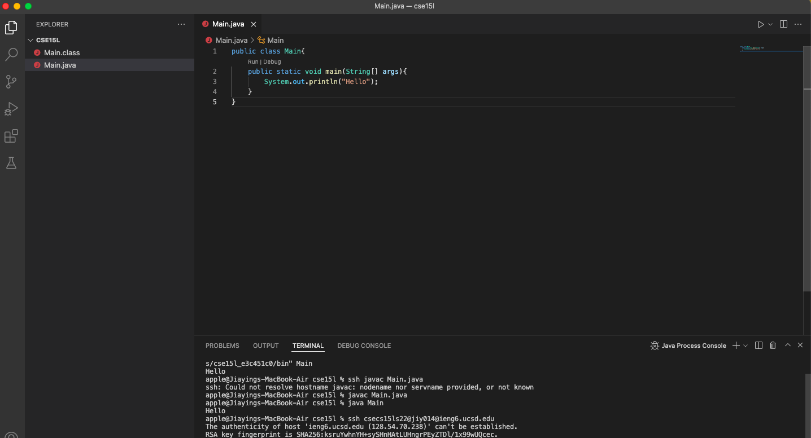
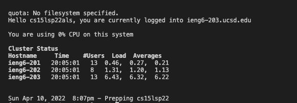
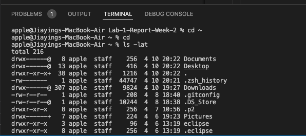
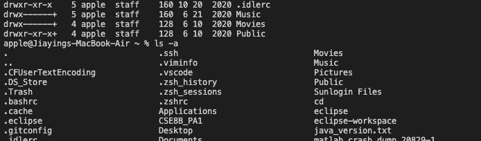
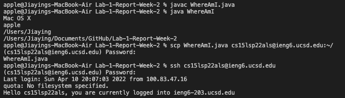
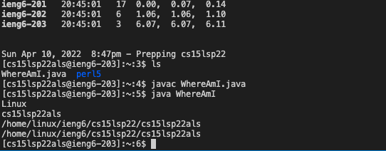
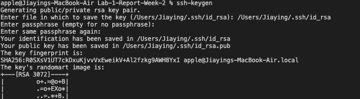
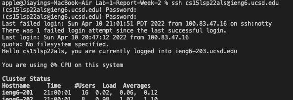
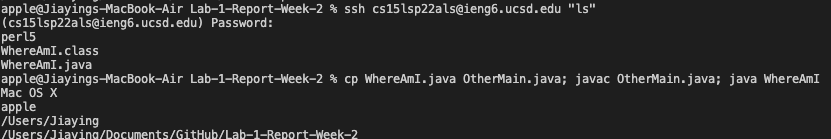

## Installing VScode
>\
Go to [Visual Studio Code](https://code.visualstudio.com/), find the right version for you computer and download. After that, install VScode. 

## Remotely Connecting
> \
First, look up account ID for [CSE15L](https://sdacs.ucsd.edu/~icc/index.php). Then run\
$ ssh cs15lsp22zz@ieng6.ucsd.edu\
using your CSE15L ID. Then type "yes" in the terminal. \

## Trying Some Commands
>\
\

For this step, pull out the terminal. Then typed in the commands listed in Week 1 Lab and observe the outcomes for each command. \

## Moving Files with scp
> \
\
For this step, create a new java file using code provided in the Lab 1 Guidance. Then compile and run the code. After that, run the following command with my cse15l ID and password:\
scp WhereAmI.java cs15lsp22zz@ieng6.ucsd.edu:~/\
Then log in to ssh again and run _ls_ command. Compile and run the code one more time, and it should have different outcome.\
## Setting an SSH Key
> \
> \
>For this step, I aim to use "ssh keys" to save time from using ssh by running "ssh keygen" command first. Then ignore the passphrase and create a random image for my key. After that, login with ssh, and run\
> * mkdir .ssh
> * logout
> * scp /Users/<user-name>/.ssh/id_rsa.pub > cs15lsp22zz@ieng6.ucsd.edu:~/.ssh/authorized_keys
After the above step, I can use ssh and scp from client to server without using password.

## Optimizing Remote Running
> \
For this step I tried different commands and methods to facilitate the running process and to save time. I also timed myself during trying different methods.