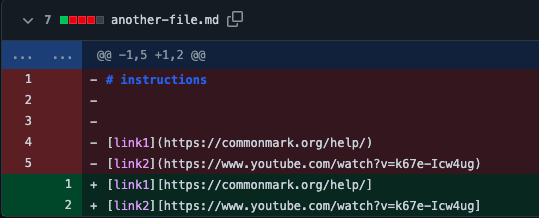
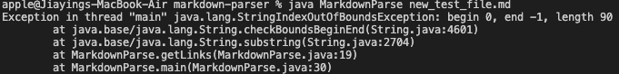
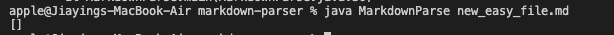
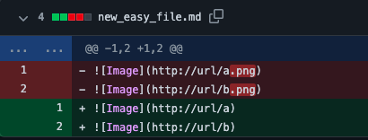
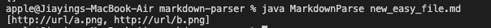

# Lab Report 2
## Code 1
>\
>\
For code 1, the bug is that instead of using (), the links are hold by []. The symptom is that the code outputs error message\ `Exception in thread "main" java.lang.StringIndexOutOfBoundsException: begin 0, end -1, length 90`\
and the failure inducing input is that the list of links I expected is not returned.

## Code 2
>\
>\
For code 2, the failure induing input is that I expected some links in the list but there is no link. The output is [], an empty list, while I am looking for some links in the list. For this code, the symptom is that the code returns [] instead of a list of links, and the bug is that the file should not be empty. The failure inducing input is that this was an empty file so there is no link at all.

## Code 3
>\
> \
For code 3, the failure induing input is that in the list, instead of returning links as I expected, it returns images. The symptom is that it returns a false type of output, and the bug is that in the orginal file, it stores png files instead of links. This was fixed by using correct type of type in the bracket. 
