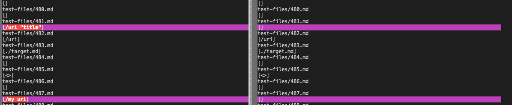
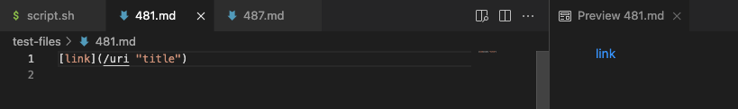
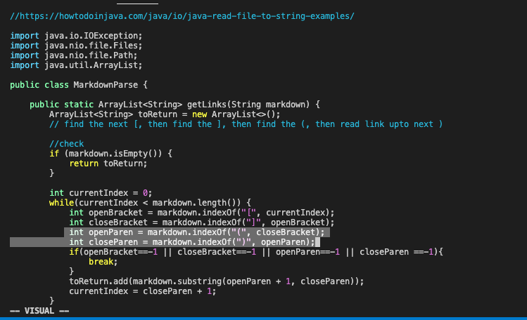
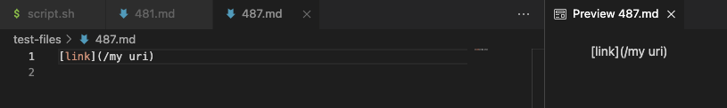

# Lab Report 5
> ### How you found the tests with different results?
> * I found the difference using vimdiff
> ### Provide a link to the test-file with different-results (in the provided repository or your repository , either is fine)
> * [link to test-file](https://github.com/nidhidhamnani/markdown-parser/tree/main/test-files)
> ### For each test:
> \
> I chose test 481 and test 487
> ### the expected output for 481 is:
> \
> Neither of the implementations are right. Instead of producing the output in the graph, it should produce [title].\
> For the my implementation, it should not only check for (), but also check for what's inside the bracket. \
> 

> ### the expected output for 487 is:
> \
> the implementation of cse15lsp22-markdown-parser is correct. Instead of producing [/my uri], it should produce [] because there is no valid link.\
> For my implementation, it has the same problem as above, it should check whether inside the bracket is valid link or not.\
> 

